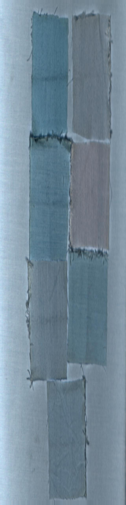
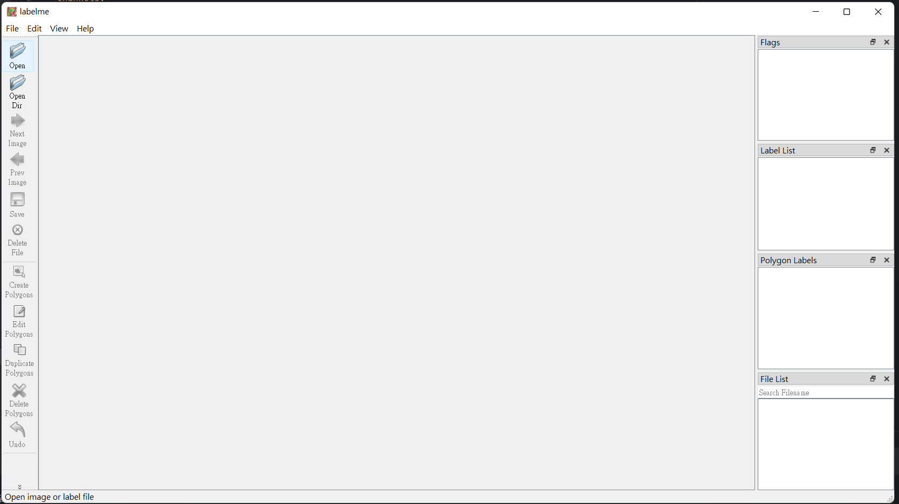
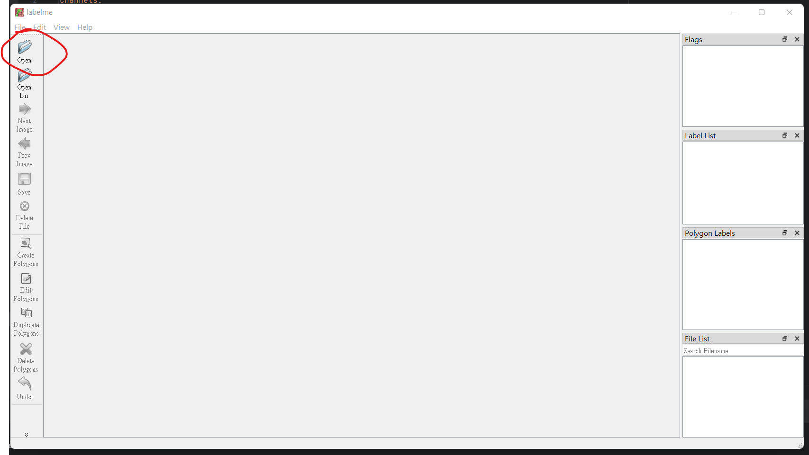
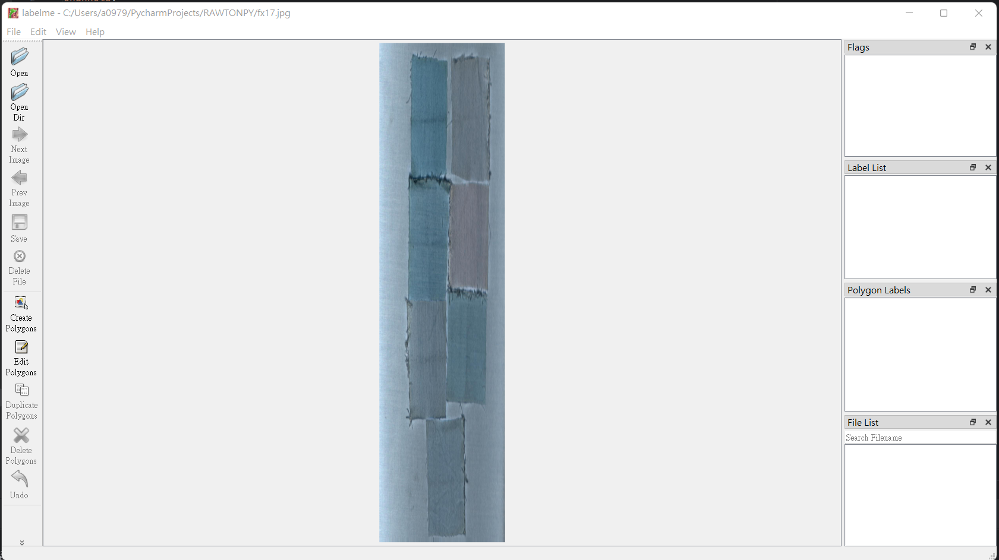
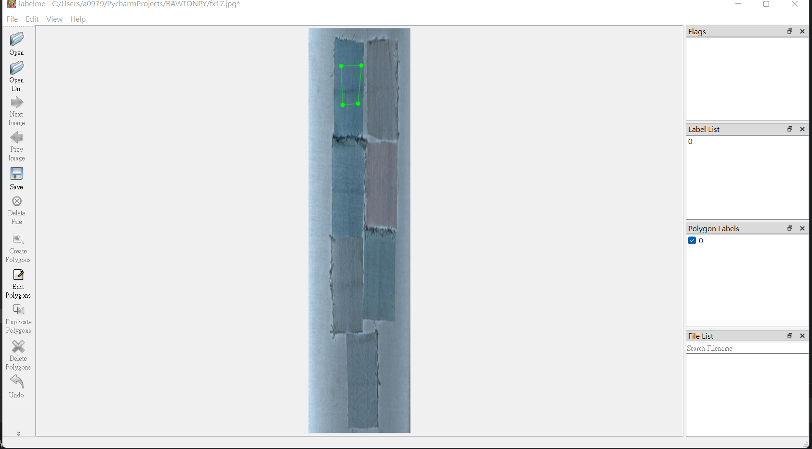
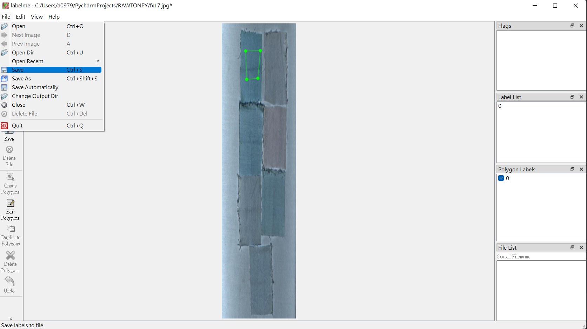
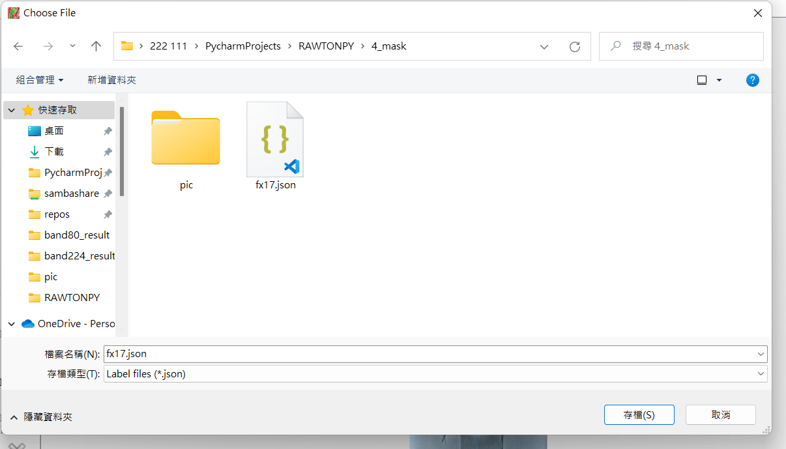
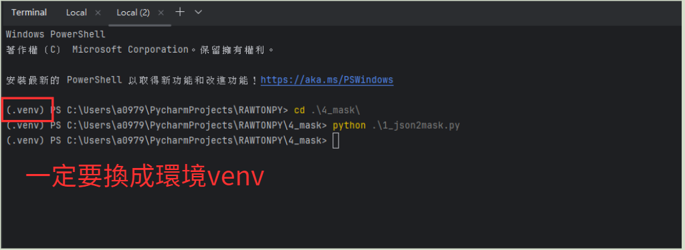

#  4_mask資料夾介紹

### 1. 透過`3_falsecolortojpg.py` 生成的.jpg檔畫偽色圖


### 2. 安裝conda 環境)
   ```shell
   conda env create -f labelme.yaml
   ```
### 3.進入labelme 環境
 ```shell
  conda activate labelme
 ```
> 待會底下的操作全都在labelme環境下

### 4.打開labelme

### 5.開啟jpg檔


### 6.開始畫groundtruth

### 7.儲存成.json


### 8.切換成venv環境
 
> **這一個步驟是重點**，`一定`要換成venv環境

### 8.透過執行1_json2mask.py生成mask.npy

